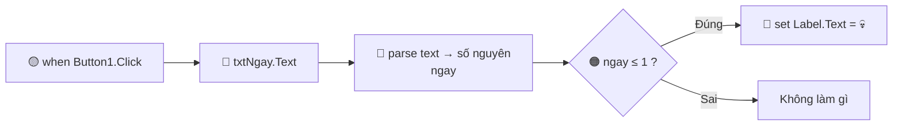

# PHÁT TRIỂN ỨNG DỤNG TRÊN THIẾT BỊ DI ĐỘNG
### MIT App Inventor 2
### Ứng dụng: **Deadline Checker**

---
> **Sinh viên:** Nguuyễn Như Khiêm  
> **MSSV:** K225480106030

**Môn học:** Lập trình di động &nbsp;|&nbsp; **Công cụ:** MIT App Inventor 2 &nbsp;|&nbsp; **Nền tảng:** Android

</div>

---

## 📋 MỤC LỤC

- [1. Tổng Quan Ứng Dụng](#1-tổng-quan-ứng-dụng)
- [2. Giới Thiệu MIT App Inventor 2](#2-giới-thiệu-mit-app-inventor-2)
  - [2.1 Giao Diện Tổng Thể](#21-giao-diện-tổng-thể)
  - [2.2 Chế Độ Designer – Thanh Công Cụ Có Gì?](#22-chế-độ-designer--thanh-công-cụ-có-gì)
  - [2.3 Kéo Thả & Thay Đổi Thuộc Tính](#23-kéo-thả--thay-đổi-thuộc-tính)
- [3. Lập Trình Bằng Block](#3-lập-trình-bằng-block)
  - [3.1 Bản Chất Của Block Programming](#31-bản-chất-của-block-programming)
  - [3.2 Phân Loại Block](#32-phân-loại-block)
  - [3.3 Ưu Điểm Và Nhược Điểm So Với Viết Code](#33-ưu-điểm-và-nhược-điểm-so-với-viết-code)
  - [3.4 Backpack – Copy Paste Block](#34-backpack--copy-paste-block)
- [4. Thiết Kế & Lập Trình Từng Screen](#4-thiết-kế--lập-trình-từng-screen)
  - [Screen 1 – About](#screen-1--about-giới-thiệu-bản-thân)
  - [Screen 2 – Kiểm Tra Deadline](#screen-2--kiểm-tra-deadline)
  - [Screen 3 – WebViewer](#screen-3--webviewer)
- [5. Kết Quả Chạy Ứng Dụng](#5-kết-quả-chạy-ứng-dụng)
- [6. Quy Trình Hoàn Chỉnh](#6-quy-trình-hoàn-chỉnh)
- [7. Build & Xuất Ứng Dụng](#7-build--xuất-ứng-dụng)

---

## 1. Tổng Quan Ứng Dụng
Xây dựng một ứng dụng Android hoàn chỉnh bằng **MIT App Inventor** – nền tảng lập trình trực quan dạng kéo-thả (drag & drop).
Ứng dụng **Deadline Checker** được xây dựng trên nền tảng **MIT App Inventor 2** — công cụ lập trình trực quan dành cho Android, không cần viết code thuần, thay vào đó là kéo thả giao diện và ghép block logic.


| Screen | Tên | Chức năng |
|--------|-----|-----------|
| Screen1 | About Me | Giới thiệu bản thân + điều hướng sang 2 screen còn lại |
| Screen2 | Giải bài toán | Giải một bài toán đơn giản (ví dụ: tính BMI, giải phương trình bậc 1...) |
| Screen3 | WebView | Nhúng và hiển thị một trang web có sẵn |

### 🛠 Công cụ sử dụng

| Công cụ | Mô tả |
|---------|-------|
| [MIT App Inventor](https://appinventor.mit.edu/) | Nền tảng tạo ứng dụng Android bằng giao diện kéo-thả |
| Trình duyệt web | Chrome / Firefox / Edge – truy cập App Inventor online |
| MIT AI2 Companion | App cài trên điện thoại để test trực tiếp |
| Android Emulator | Giả lập thiết bị Android (nếu không có điện thoại thật) |

### 🗂️ Cấu Trúc Dự Án

```
DeadlineChecker/
├── 📱Screen1  (About Me)
│   ├── Label – Tên, MSSV, lớp
│   ├── Image – Ảnh đại diện
│   ├── Button → mở Screen2
│   └── Button → mở Screen3
│
├── 📱Screen2  (Giải bài toán)
│   ├── TextBox – Nhập dữ liệu
│   ├── Button  – Tính toán
│   └── Label   – Hiển thị kết quả
│
└── 📱Screen3  (WebView)
    ├── WebViewer – Hiển thị trang web
    └── Button    – Quay lại Screen1
```

### 📊 Bảng Tóm Tắt Tính Năng

| Screen | Tên | Chức năng chính | Components sử dụng |
|:------:|-----|-----------------|-------------------|
| 1 | About | Thông tin sinh viên, điều hướng sang Screen khác | Label, Button, Image, VerticalArrangement |
| 2 | Deadline Check | Nhập số ngày & %, trả về mức nguy hiểm + khuyến nghị | TextBox, Button, Label, Logic Block |
| 3 | WebViewer | Mở GitHub / StackOverflow / ChatGPT trong app | WebViewer, Button, HorizontalArrangement |

---

## 2. Giới Thiệu MIT App Inventor 2

### 2.1 Giao Diện Tổng Thể

MIT App Inventor 2 (AI2) là môi trường lập trình trực quan chạy trên trình duyệt, truy cập tại `appinventor.mit.edu`. Toàn bộ môi trường làm việc chia thành **2 chế độ chính** chuyển đổi bằng nút ở góc trên phải:
#### 1. DESIGNER : Thiết kế giao diện người dùng (UI) bằng cách kéo thả component vào màn hình điện thoại


#### 2. BLOCKS EDITOR : Lập trình logic bằng cách kéo thả các khối lệnh màu sắc và ghép chúng lại 


---

### 2.2 Chế Độ Designer – Thanh Công Cụ Có Gì?

Khi ở chế độ **Designer**, màn hình chia thành **4 vùng làm việc**:
1. PALETTE (Kho linh kiện)
2. VIEWER (Màn hình điện thoại ảo)
3. COMPONENTS (Cây thành phần)
4. PROPERTIES (Bảng thuộc tính)

#### 🗃️ Chi Tiết Từng Vùng

**① PALETTE – Kho linh kiện**

Đây là "kho vũ khí" chứa tất cả các thành phần có thể thêm vào app, chia theo nhóm:

| Nhóm | Thành phần tiêu biểu | Dùng để làm gì |
|------|---------------------|----------------|
| `User Interface` | Button, Label, TextBox, Image, CheckBox | Các thành phần hiển thị & tương tác cơ bản |
| `Layout` | HorizontalArrangement, VerticalArrangement, TableArrangement | Sắp xếp vị trí các component |
| `Media` | Camera, Player, Sound, WebViewer | Xử lý hình ảnh, âm thanh, video, web |
| `Drawing & Animation` | Canvas, Ball, ImageSprite | Vẽ, game, hoạt ảnh |
| `Sensors` | AccelerometerSensor, LocationSensor, Clock | Cảm biến điện thoại |
| `Social` | PhoneCall, Texting, Twitter | Gọi điện, nhắn tin |
| `Storage` | TinyDB, File, CloudDB | Lưu trữ dữ liệu |
| `Connectivity` | Web, BluetoothClient | Kết nối mạng & Bluetooth |

**② VIEWER – Màn hình điện thoại ảo**

- Hiển thị trực quan giao diện app đang được xây dựng
- Kéo component từ Palette thả vào đây để thêm vào app
- Click vào component trong Viewer để chỉnh sửa
- Không thể tương tác thật (bấm nút không chạy được) — đây chỉ là bản xem trước

**③ COMPONENTS – Cây thành phần**

- Liệt kê toàn bộ component đã thêm theo dạng cây phân cấp
- Click vào tên component để chọn và chỉnh sửa
- Có thể đổi tên (Rename), xóa (Delete) component tại đây

**④ PROPERTIES – Bảng thuộc tính**

- Hiển thị toàn bộ thuộc tính của component đang được chọn
- Thay đổi trực tiếp: gõ vào ô, chọn màu, tick checkbox...

---

### 2.3 Kéo Thả & Thay Đổi Thuộc Tính

#### Quy Trình Kéo Thả Component
**Các bước:**

```
Bước 1 ──► Tìm component phù hợp trong PALETTE bên trái
            Ví dụ: cần nút bấm → tìm "Button" trong nhóm User Interface

Bước 2 ──► Giữ chuột trái vào component, kéo sang VIEWER
            (Màn hình điện thoại ảo ở giữa)

Bước 3 ──► Thả chuột tại vị trí muốn đặt component
            → Component xuất hiện trên màn hình ảo
            → Tên component tự động thêm vào cây COMPONENTS

Bước 4 ──► Click vào component vừa thêm
            → Bảng PROPERTIES bên phải hiển thị đầy đủ thuộc tính

Bước 5 ──► Chỉnh sửa thuộc tính theo ý muốn:
            • Text      → nội dung chữ hiển thị
            • Width     → Fill Parent (đầy màn hình) hoặc số pixel cụ thể
            • Height    → Automatic hoặc pixel cụ thể
            • FontSize  → cỡ chữ (số)
            • FontBold  → tick để in đậm
            • BackgroundColor → click để chọn màu nền
            • TextColor → màu chữ
            • Enabled   → true/false (có thể bấm hay không)
            • Visible   → true/false (ẩn/hiện)
```

#### Bảng Thuộc Tính Quan Trọng

| Thuộc tính | Kiểu giá trị | Ý nghĩa | Ví dụ |
|-----------|-------------|---------|-------|
| `Text` | Chuỗi | Nội dung hiển thị | `"📅 Kiểm tra Deadline"` |
| `Width` | Pixel / Fill Parent / Wrap Content | Chiều rộng component | `Fill Parent` |
| `Height` | Pixel / Automatic | Chiều cao component | `50` hoặc `Automatic` |
| `FontSize` | Số | Cỡ chữ (đơn vị sp) | `18` |
| `FontBold` | true/false | In đậm hay không | `true` |
| `FontItalic` | true/false | In nghiêng | `false` |
| `BackgroundColor` | Màu | Màu nền | Chọn từ bảng màu |
| `TextColor` | Màu | Màu chữ | `White` |
| `Enabled` | true/false | Có thể tương tác không | `true` |
| `Visible` | true/false | Ẩn hay hiện | `true` |
| `Hint` | Chuỗi | Chữ gợi ý (mờ) trong TextBox | `"Nhập số ngày..."` |
| `NumbersOnly` | true/false | TextBox chỉ nhận số | `true` |
| `HomeUrl` | URL | Trang mặc định của WebViewer | `"https://github.com"` |
| `Alignment` | Left/Center/Right | Căn lề chữ | `Center` |

> 💡 **Tại sao cần kéo thả?**  
> Thay vì viết XML layout phức tạp như Android Studio, AI2 cho phép bạn **thấy ngay kết quả** khi kéo thả — không cần biết cấu trúc XML, không cần gõ thuộc tính thủ công. Đây là cách tiếp cận **WYSIWYG** (What You See Is What You Get — thấy gì được nấy).

> 💡 **Tại sao dùng `Fill Parent` cho Width?**  
> Điện thoại Android có hàng trăm kích thước màn hình khác nhau. Đặt Width = `Fill Parent` giúp component **tự co giãn** để luôn vừa khít màn hình, thay vì bị cắt hoặc bị thừa khoảng trắng.

---

## 3. Lập Trình Bằng Block

### 3.1 Bản Chất Của Block Programming

MIT App Inventor dùng mô hình **Visual Block Programming** — thay vì gõ code chữ, lập trình viên **kéo thả các khối lệnh hình học** có màu sắc và **ghép chúng lại** như xếp LEGO.

Mỗi block có hình dạng đặc biệt: phần lồi (🔌) và phần lõm (🔳) khớp với nhau, giống mảnh ghép puzzle. Block **chỉ ghép được khi logic đúng** — ví dụ, không thể nhét một block "số" vào chỗ cần "chuỗi văn bản". Điều này giúp **tránh lỗi sai kiểu dữ liệu**.

**So sánh trực quan:**

## ☕ CODE TRUYỀN THỐNG (Java/Kotlin)

```java
// Sự kiện click nút
button.setOnClickListener(
    new View.OnClickListener() {
        @Override
        public void onClick(View v) {

            int ngay = Integer.parseInt(
                txtNgay.getText().toString()
            );

            if (ngay <= 1) {
                label.setText("💀");
            }
        }
    }
);
```

**Nhận xét:**
- Khoảng 10 dòng code
- Phải nhớ cú pháp Java/Kotlin
- Tự viết logic xử lý

---

## 🧩 BLOCK (MIT App Inventor)



**Nhận xét:**
- Kéo thả khoảng 6 block
- Không cần nhớ cú pháp
- Logic được xây dựng bằng giao diện trực quan

**Cơ chế ghép block:**


---

### 3.2 Phân Loại Block

Mỗi loại block có màu sắc riêng để dễ nhận biết:

| Màu | Nhóm | Chứa gì | Ví dụ cụ thể |
|-----|------|---------|-------------|
| 🟡 **Vàng** | Events (Sự kiện) | Khi nào thì chạy code | `when Button1.Click`, `when Screen1.Initialize` |
| 🟠 **Cam** | Control (Điều khiển) | Cấu trúc logic | `if / else if / else`, `for each`, `while`, `open another screen` |
| 🔵 **Xanh biển** | Component | Lấy/gán thuộc tính component | `set Label1.Text to`, `TextBox1.Text`, `call WebViewer1.GoToUrl` |
| 🟢 **Xanh lá** | Math & Text | Số học, chuỗi | `+`, `-`, `*`, `/`, `join`, `length`, `number` |
| 🔴 **Đỏ** | Variables (Biến) | Khai báo và dùng biến | `initialize global [tên] to`, `set [biến] to`, `get [biến]` |
| 🟣 **Tím** | Procedures (Hàm) | Tự định nghĩa hàm | `to [tên_hàm] do ...`, `call [tên_hàm]` |
| ⚫ **Xám** | Logic | Điều kiện so sánh | `and`, `or`, `not`, `=`, `<`, `>`, `true`, `false` |


---

### 3.3 Ưu Điểm Và Nhược Điểm So Với Viết Code

| Nội dung                          | Ưu điểm                                                                                    | Nhược điểm                                                                                                             |
| --------------------------------- | ------------------------------------------------------------------------------------------ | ---------------------------------------------------------------------------------------------------------------------- |
| Cú pháp lập trình                 | ✅ Hầu như không phát sinh lỗi cú pháp vì các block chỉ ghép được khi tương thích với nhau. | ❌ Không linh hoạt bằng ngôn ngữ lập trình truyền thống khi cần xử lý logic phức tạp.                                   |
| Tính trực quan                    | ✅ Các block thể hiện rõ luồng xử lý, dễ quan sát và hiểu chương trình.                     | ❌ Khi số lượng block lớn, workspace trở nên rối rắm và khó theo dõi.                                                   |
| Khả năng học tập                  | ✅ Giúp người mới tập trung vào tư duy thuật toán thay vì ghi nhớ cú pháp ngôn ngữ.         | ❌ Khó tiếp cận các khái niệm lập trình nâng cao như thiết kế kiến trúc phần mềm hoặc tối ưu mã nguồn.                  |
| Tốc độ phát triển                 | ✅ Tạo nguyên mẫu (Prototype) nhanh, có thể xây dựng ứng dụng cơ bản chỉ trong vài giờ.     | ❌ Khi dự án lớn, tốc độ phát triển giảm do việc quản lý block trở nên khó khăn.                                        |
| Môi trường phát triển             | ✅ Hoạt động hoàn toàn trên trình duyệt, không cần cài đặt Android Studio, JDK hay Gradle.  | ❌ Phụ thuộc vào kết nối Internet và máy chủ của MIT App Inventor.                                                      |
| Kiểm thử ứng dụng                 | ✅ Có thể kết nối AI2 Companion để xem kết quả ngay trên điện thoại mà không cần build APK. | ❌ Khả năng debug và phân tích lỗi hạn chế hơn so với các IDE chuyên nghiệp.                                            |
| Tính năng nền tảng                | ✅ Cung cấp đầy đủ các thành phần cơ bản để xây dựng ứng dụng Android đơn giản.             | ❌ Không hỗ trợ đầy đủ các API Android nâng cao, background service, animation phức tạp hoặc xử lý hệ thống chuyên sâu. |
| Hiệu năng                         | ✅ Đáp ứng tốt các ứng dụng học tập, quản lý và tiện ích đơn giản.                          | ❌ Hiệu năng thấp hơn ứng dụng native được phát triển bằng Java hoặc Kotlin.                                            |
| Hỗ trợ nền tảng                   | ✅ Có thể xuất trực tiếp tệp APK để cài đặt trên Android.                                   | ❌ Chỉ hỗ trợ Android, không hỗ trợ phát triển ứng dụng iOS.                                                            |
| Làm việc nhóm và quản lý mã nguồn | ✅ Dễ chia sẻ dự án cho người mới học.                                                      | ❌ Không tích hợp Git/Version Control, việc cộng tác thường phải trao đổi tệp `.aia` thủ công.                          |

---

### 3.4 Backpack – Copy Paste Block

**Backpack** (Ba lô) là tính năng clipboard đặc biệt trong Blocks Editor, cho phép **sao chép block** giữa các Screen hoặc thậm chí giữa các project khác nhau.

**Icon Backpack** nằm ở **góc trên bên phải** của Blocks Editor.


#### Cách sử dụng Backpack:

##### CÁCH THÊM VÀO BACKPACK:
Bước 1: Click chuột phải vào block muốn copy 

Bước 2: Block được copy vào Backpack → Icon ba lô thay đổi

##### CÁCH LẤY RA TỪ BACKPACK:
Bước 1: Chuyển sang Screen hoặc project khác
Bước 2: Click vào icon 🎒 Backpack → Danh sách block đã lưu xuất hiện 
Bước 3: Kéo block từ Backpack thả vào workspace → Block được copy (bản gốc vẫn còn trong Backpack)


#### Backpack hoạt động ở đâu?

| Phạm vi | Có dùng được không | Ghi chú |
|---------|-------------------|---------|
| Giữa các Screen trong cùng project | ✅ Có | Dùng nhiều nhất |
| Giữa các project khác nhau | ✅ Có | Mở project mới, Backpack vẫn còn |
| Sau khi đóng trình duyệt & mở lại | ⚠️ Phụ thuộc | Lưu trong browser storage, có thể mất |
| Trên máy tính khác | ❌ Không | Backpack không đồng bộ qua tài khoản |

> ⚠️ **Lưu ý quan trọng:** Backpack lưu trong bộ nhớ trình duyệt (localStorage). Nếu xóa cache trình duyệt → **mất toàn bộ Backpack**. Hãy export `.aia` thường xuyên để backup project.

> 💡 **Mẹo sử dụng:** Block xử lý điều hướng Screen (open another screen) giống nhau ở mọi Screen → tạo 1 lần ở Screen1 → dùng Backpack copy sang các Screen còn lại, chỉ cần đổi tên Screen.

---

## 4. Thiết Kế & Lập Trình Từng Screen

### Bước 1 – Đăng nhập và tạo project mới

1. Truy cập **[https://appinventor.mit.edu](https://appinventor.mit.edu)**
2. Nhấn **"Create Apps!"** → Đăng nhập bằng tài khoản Google
3. Chọn **Projects → Start new project**
4. Đặt tên project (không dấu, không khoảng trắng): ví dụ `DeadlineChecker`


> ✅ Giao diện chính gồm 2 phần: **Designer** (thiết kế giao diện) và **Blocks** (lập trình logic)

### Bước 2 – Thêm Screen mới

1. Ở góc trên cùng, nhấn **"Add Screen"**
2. Đặt tên: `Screen2`, `Screen3`
3. Mỗi screen được thiết kế và lập trình độc lập

---

### Screen 1 – About me (Giới Thiệu Bản Thân)

#### Cách kéo thả và chỉnh thuộc tính

1. Trong tab **Designer**, tìm component trong bảng **Palette** bên trái
2. **Kéo** component vào vùng **Viewer** (khung giả lập điện thoại ở giữa)
3. Sau khi thả, click chọn component → bảng **Properties** bên phải sẽ hiện ra
4. Chỉnh các thuộc tính: màu sắc, font chữ, kích thước, căn lề...

#### Cấu trúc cây thành phần giao diện (Component Tree)
```
Screen1
└── VerticalArrangement1
    ├── Avatar
    ├── HoTen
    ├── Label_HoTen
    │
    ├── HorizontalArrangement1
    │   ├── Label_Icon_MSSV
    │   └── VerticalArrangement2
    │       ├── LabelMSSV
    │       └── Label_MoTa_MSSV
    │
    ├── HorizontalArrangement2
    │   ├── Label_Icon_lop
    │   └── VerticalArrangement3
    │       ├── Label_Lop
    │       └── Label_MoTa_Lop
    │
    └── VerticalArrangement4
        ├── Button_Deadline
        └── Button_WebView
```

#### 📋 Danh Sách Components & Cấu Hình

| Thành phần                 | Thuộc tính        | Giá trị              |
| -------------------------- | ----------------- | -------------------- |
| **Screen1**                | AppName           | Deadline Checker     |
|                            | Title             | About me             |
|                            | BackgroundColor   | #F5F2EA              |
| **VerticalArrangement1**   | Width             | Fill Parent          |
|                            | Height            | Fill Parent          |
|                            | AlignHorizontal   | Center               |
|                            | AlignVertical     | Top                  |
|                            | BackgroundColor   | None                 |
| **Avatar**                 | Picture           | Upload ảnh đại diện  |
|                            | Width             | 150px                |
|                            | Height            | 150px                |
|                            | ScalePictureToFit | true                 |
| **HoTen**                  | Text              | Nguyễn Như Khiêm     |
|                            | FontSize          | 20                   |
|                            | FontBold          | true                 |
|                            | TextColor         | #7A5A00              |
| **Label_HoTen**            | Text              | Họ và tên            |
|                            | FontSize          | 12                   |
|                            | TextColor         | Gray                 |
| **HorizontalArrangement1** | Width             | Fill Parent          |
|                            | Height            | Automatic            |
| **Label_Icon_MSSV**        | Text              | 🎓                   |
|                            | FontSize          | 20                   |
|                            | Width             | 40px                 |
| **VerticalArrangement2**   | Width             | Automatic            |
|                            | Height            | Automatic            |
| **LabelMSSV**              | Text              | K225480106030        |
|                            | FontSize          | 16                   |
|                            | FontBold          | true                 |
| **Label_MoTa_MSSV**        | Text              | Mã số sinh viên      |
|                            | FontSize          | 12                   |
|                            | TextColor         | Gray                 |
| **HorizontalArrangement2** | Width             | Fill Parent          |
|                            | Height            | Automatic            |
| **Label_Icon_lop**         | Text              | 🏫                   |
|                            | FontSize          | 20                   |
|                            | Width             | 40px                 |
| **VerticalArrangement3**   | Width             | Automatic            |
|                            | Height            | Automatic            |
| **Label_Lop**              | Text              | K58KTP               |
|                            | FontSize          | 16                   |
|                            | FontBold          | true                 |
| **Label_MoTa_Lop**         | Text              | Lớp học              |
|                            | FontSize          | 12                   |
|                            | TextColor         | Gray                 |
| **VerticalArrangement4**   | Width             | 80%                  |
|                            | Height            | Automatic            |
|                            | AlignHorizontal   | Center               |
| **Button_Deadline**        | Text              | 📅 Kiểm tra Deadline |
|                            | Width             | Fill Parent          |
|                            | FontSize          | 16                   |
|                            | FontBold          | true                 |
|                            | TextColor         | White                |
|                            | BackgroundColor   | #0F8B8D              |
|                            | Shape             | Rounded              |
| **Button_WebView**         | Text              | 📄 Tài liệu của tôi  |
|                            | Width             | Fill Parent          |
|                            | FontSize          | 16                   |
|                            | FontBold          | true                 |
|                            | TextColor         | White                |
|                            | BackgroundColor   | #3B82F6              |
|                            | Shape             | Rounded              |

#### 🎨 Bố Cục Giao Diện


#### 🟡 Block Lập Trình – Screen1 (Xử Lý Điều Hướng Giữa Các Màn Hình)

##### Chức năng

* Khi nhấn **Button_Deadline** → chuyển sang **Screen2**.
* Khi nhấn **Button_WebView** → chuyển sang **Screen3**.

---

#### Bước 1: Mở giao diện Blocks

1. Mở dự án MIT App Inventor.
2. Chọn **Screen1**.
3. Nhấn tab **Blocks** ở góc trên bên phải.

---

#### Bước 2: Tạo sự kiện cho Button_Deadline

##### Kéo khối sự kiện Click

1. Trong danh sách bên trái chọn **Button_Deadline**.
2. Kéo khối:

```text
when Button_Deadline.Click
do
```
vào vùng làm việc.

#### Thêm khối mở màn hình

1. Trong nhóm **Control**.
2. Kéo khối:

```text
open another screen screenName
```

đặt vào bên trong phần `do`.

---

#### Bước 3: Tạo sự kiện cho Button_WebView

##### Kéo khối sự kiện Click

1. Chọn **Button_WebView**.
2. Kéo khối:

```text
when Button_WebView.Click
do
```

ra vùng làm việc.

##### Thêm khối mở màn hình

1. Trong nhóm **Control**.
2. Kéo khối:

```text
open another screen screenName
```

vào phần `do`.

---

Người dùng nhấn nút trên màn hình chính (Screen1) sẽ được chuyển đến màn hình tương ứng theo chức năng đã thiết kế.

#### Kết Quả


---

### Screen 2 – Kiểm Tra Deadline

#### Cấu trúc cây thành phần giao diện (Component Tree)
```text
Screen2
└── VerticalArrangement6
    ├── Title
    │
    ├── VerticalArrangement1
    │   └── VerticalArrangement2
    │       ├── Label_Ngay
    │       ├── Label_MoTa_Ngay
    │       └── TextBox_Ngay
    │
    ├── VerticalArrangement4
    │   ├── Label_PhanTram
    │   ├── Label_MoTa_PhanTram
    │   └── TextBox_PhanTram
    │
    ├── Button_DanhGia
    │
    ├── VerticalArrangement7
    │   ├── Label_KetQua
    │   └── Label_KhuyenNghi
    │
    └── VerticalArrangement5
        ├── Button_AboutMe
        └── Button_WebView
```
---

#### 📋 Danh Sách Components & Cấu Hình

| Thành phần               | Thuộc tính      | Giá trị                             |
| ------------------------ | --------------- | ----------------------------------- |
| **Screen2**              | AppName         | Deadline Checker                    |
|                          | Title           | Kiểm Tra Deadline                   |
|                          | BackgroundColor | #F5F2EA                             |
| **VerticalArrangement6** | Width           | Fill Parent                         |
|                          | Height          | Fill Parent                         |
|                          | AlignHorizontal | Center                              |
|                          | AlignVertical   | Top                                 |
|                          | BackgroundColor | None                                |
| **Title**                | Text            | ⏰ Kiểm tra Checker                 |
|                          | FontSize        | 25                                  |
|                          | FontBold        | true                                |
|                          | TextColor       | #0F8B8D                             |
| **VerticalArrangement1** | Width           | Fill Parent                         |
|                          | Height          | Fill Parent                         |
| **VerticalArrangement2** | Width           | 80%                                 |
|                          | Height          | Automatic                           |
| **Label_Ngay**           | Text            | 📅 Còn bao nhiêu ngày?              |
|                          | FontSize        | 18                                  |
|                          | FontBold        | true                                |
| **Label_MoTa_Ngay**      | Text            | Nhập số ngày còn lại trước deadline |
|                          | FontSize        | 14                                  |
|                          | TextColor       | Gray                                |
| **TextBox_Ngay**         | Hint            | VD: 3                               |
|                          | NumbersOnly     | true                                |
|                          | Width           | Fill Parent                         |
| **VerticalArrangement4** | Width           | 80%                                 |
|                          | Height          | Automatic                           |
| **Label_PhanTram**       | Text            | 📊 Đã hoàn thành bao nhiêu %?       |
|                          | FontSize        | 18                                  |
|                          | FontBold        | true                                |
| **Label_MoTa_PhanTram**  | Text            | Nhập phần trăm tiến độ hiện tại     |
|                          | FontSize        | 14                                  |
|                          | TextColor       | Gray                                |
| **TextBox_PhanTram**     | Hint            | VD: 20                              |
|                          | NumbersOnly     | true                                |
|                          | Width           | Fill Parent                         |
| **Button_DanhGia**       | Text            | 🔍 Đánh Giá                         |
|                          | Width           | 50%                                 |
|                          | FontSize        | 20                                  |
|                          | FontBold        | true                                |
|                          | TextColor       | White                               |
|                          | BackgroundColor | #3B82F6                             |
|                          | Shape           | Rounded                             |
| **VerticalArrangement7** | Width           | 80%                                 |
|                          | Height          | Automatic                           |
|                          | BackgroundColor | White                               |
| **Label_KetQua**         | Text            | *(để trống)*                        |
|                          | FontSize        | 14                                  |
|                          | FontBold        | true                                |
| **Label_KhuyenNghi**     | Text            | *(để trống)*                        |
|                          | FontSize        | 14                                  |
| **VerticalArrangement5** | Width           | 80%                                 |
|                          | Height          | Automatic                           |
|                          | AlignHorizontal | Center                              |
| **Button_AboutMe**       | Text            | 👤 About me                         |
|                          | Width           | Fill Parent                         |
|                          | FontSize        | 18                                  |
|                          | FontBold        | true                                |
|                          | TextColor       | White                               |
|                          | BackgroundColor | #0F8B8D                             |
|                          | Shape           | Rounded                             |
| **Button_WebView**       | Text            | 📄 Tài Liệu cứu mạng               |
|                          | Width           | Fill Parent                         |
|                          | FontSize        | 18                                  |
|                          | FontBold        | true                                |
|                          | TextColor       | White                               |
|                          | BackgroundColor | #0F8B8D                             |
|                          | Shape           | Rounded                             |

---

#### 📊 Bảng Logic Đánh Giá

| Điều kiện | Mức độ | Khuyến nghị |
|-----------|--------|-------------|
| `ngay ≤ 1` VÀ `phan ≤ 10%` | 💀 **Chúc may mắn** | Pha cà phê · Tắt Facebook · Cầu nguyện |
| `ngay ≤ 3` VÀ `phan ≤ 30%` | 😨 **Nguy hiểm** | Hủy kế hoạch đi chơi · Mở laptop ngay |
| `ngay ≤ 7` VÀ `phan ≤ 60%` | 😐 **Căng nhẹ** | Tăng tốc · Giảm Netflix đi |
| Còn lại | 🙂 **An toàn** | Bạn là người hiếm hoi làm đồ án đúng tiến độ 👏 |

#### 🎨 Bố Cục Giao Diện


#### 🟡 Block Lập Trình – Screen2


```
╔══════════════════════════════════════════════════════════════════╗
║  🟡 when  [Button_DanhGia] . Click                               ║
║       do                                                         ║
║                                                                  ║
║     🔴 initialize local [ngay] to                                ║
║              ◄ 🟢 number ◄ 🔵 TextBox_Ngay.Text ► ►             ║
║                                                                  ║
║     🔴 initialize local [phan] to                                ║
║              ◄ 🟢 number ◄ 🔵 TextBox_Phan.Text ► ►             ║
║                                                                  ║
║     ┌────────────────────────────────────────────────────────┐   ║
║     │ 🟠 if  ⚫ [ngay] ≤ [1]  AND  ⚫ [phan] ≤ [10]          │   ║
║     │    then                                                │   ║
║     │      🔵 set Label_KetQua.Text to                       │   ║
║     │              ◄ 🟢 "Mức độ nguy hiểm: 💀 Chúc may mắn" ►│   ║
║     │      🔵 set Label_KhuyenNghi.Text to                   │   ║
║     │              ◄ 🟢 "Khuyến nghị:                         │   ║
║     │                    - Pha cà phê                         │   ║
║     │                    - Tắt Facebook                       │   ║
║     │                    - Cầu nguyện" ►                     │   ║
║     │                                                        │   ║
║     │ 🟠 else if  ⚫ [ngay] ≤ [3]  AND  ⚫ [phan] ≤ [30]     │   ║
║     │    then                                                │   ║
║     │      🔵 set Label_KetQua.Text to                       │   ║
║     │              ◄ 🟢 "Mức độ nguy hiểm: 😨 Nguy hiểm" ►  │   ║
║     │      🔵 set Label_KhuyenNghi.Text to                   │   ║
║     │              ◄ 🟢 "Khuyến nghị:                         │   ║
║     │                    - Hủy kế hoạch đi chơi               │   ║
║     │                    - Mở laptop ngay" ►                 │   ║
║     │                                                        │   ║
║     │ 🟠 else if  ⚫ [ngay] ≤ [7]  AND  ⚫ [phan] ≤ [60]     │   ║
║     │    then                                                │   ║
║     │      🔵 set Label_KetQua.Text to                       │   ║
║     │              ◄ 🟢 "Mức độ nguy hiểm: 😐 Căng nhẹ" ►   │   ║
║     │      🔵 set Label_KhuyenNghi.Text to                   │   ║
║     │              ◄ 🟢 "Khuyến nghị:                         │   ║
║     │                    - Tăng tốc thôi                      │   ║
║     │                    - Giảm Netflix đi" ►                │   ║
║     │                                                        │   ║
║     │ 🟠 else                                                │   ║
║     │    then                                                │   ║
║     │      🔵 set Label_KetQua.Text to                       │   ║
║     │              ◄ 🟢 "Mức độ nguy hiểm: 🙂 An toàn" ►    │   ║
║     │      🔵 set Label_KhuyenNghi.Text to                   │   ║
║     │              ◄ 🟢 "Bạn là người hiếm hoi làm đồ án    │   ║
║     │                    đúng tiến độ. 👏" ►                 │   ║
║     └────────────────────────────────────────────────────────┘   ║
╚══════════════════════════════════════════════════════════════════╝

╔══════════════════════════════════════════════════════════╗
║  🟡 when  [Button_Back] . Click                          ║
║       do                                                 ║
║     ┌───────────────────────────────────────────┐        ║
║     │ 🟠 close screen                           │        ║
║     └───────────────────────────────────────────┘        ║
╚══════════════════════════════════════════════════════════╝
```

**Giải thích các block:**
- `number(TextBox.Text)` — chuyển chuỗi văn bản sang số để so sánh được
- `if / else if / else` — chuỗi điều kiện, kiểm tra lần lượt từ trên xuống
- `AND` — cả hai điều kiện phải đúng cùng lúc
- `set Label.Text to` — gán nội dung cho nhãn hiển thị kết quả
- `close screen` — đóng Screen hiện tại, quay về Screen trước

---

### Screen 3 – WebViewer

#### 🎨 Bố Cục Giao Diện

```
┌─────────────────────────────┐
│         Screen 3            │
│    🌐 Tài Liệu Cứu Mạng    │
├─────────────────────────────┤
│ ┌────────┬────────┬───────┐ │
│ │🐙 Git  │📚Stack │🤖 GPT│ │  ← Thanh chọn web
│ └────────┴────────┴───────┘ │
├─────────────────────────────┤
│                             │
│                             │
│    [Nội dung trang web      │
│     hiển thị ở đây          │
│     — WebViewer Component]  │
│                             │
│                             │
│                             │
│                             │
│                             │
└─────────────────────────────┘
```

> 📸 **[Chèn ảnh chụp màn hình Designer – Screen3 tại đây]**

#### 📋 Danh Sách Components & Cấu Hình

```
Screen3
│  Title: "🌐 Tài Liệu Cứu Mạng"
│
├── HorizontalArrangement1    ← Thanh nút chọn web
│     Width: Fill Parent
│     Height: Automatic
│
│   ├── Button_GitHub
│   │     Text: "🐙 GitHub"
│   │     Width: Fill Parent
│   │     BackgroundColor: [xám đậm]
│   │     TextColor: White
│   │
│   ├── Button_Stack
│   │     Text: "📚 Stack"
│   │     Width: Fill Parent
│   │     BackgroundColor: [cam]
│   │     TextColor: White
│   │
│   └── Button_ChatGPT
│         Text: "🤖 ChatGPT"
│         Width: Fill Parent
│         BackgroundColor: [xanh lá]
│         TextColor: White
│
└── WebViewer1
      Width: Fill Parent
      Height: Fill Parent      ← Chiếm toàn bộ phần còn lại
      HomeUrl: https://github.com
```

> **💡 Vì sao chọn 3 trang web này?**  
> Đây là bộ ba "vũ khí sinh tồn" của sinh viên CNTT khi deadline đến gần:
> - **GitHub** → tìm source code mẫu, xem hướng dẫn, clone project tham khảo
> - **StackOverflow** → tra cứu lỗi, đọc giải pháp từ triệu lập trình viên khác
> - **ChatGPT** → hỏi giải thích nhanh, nhờ debug, tóm tắt tài liệu dài

> **💡 Về hỗ trợ giao diện điện thoại:**  
> WebViewer trong App Inventor dùng WebView của Android — trình duyệt nhúng sẵn. Các trang web responsive (GitHub, StackOverflow, ChatGPT) tự động điều chỉnh layout cho màn hình nhỏ. Cần đảm bảo `Width = Fill Parent` và `Height = Fill Parent` để WebViewer chiếm đủ diện tích màn hình.

#### 🟡 Block Lập Trình – Screen3

> 📸 **[Chèn ảnh chụp màn hình Blocks Editor – Screen3 tại đây]**

```
╔══════════════════════════════════════════════════════════╗
║  🟡 when  Screen3 . Initialize                           ║
║       do                                                 ║
║     ┌─────────────────────────────────────────────┐      ║
║     │ 🔵 call WebViewer1 . GoToUrl                │      ║
║     │         url: ◄ 🟢 "https://github.com" ►    │      ║
║     └─────────────────────────────────────────────┘      ║
╚══════════════════════════════════════════════════════════╝

╔══════════════════════════════════════════════════════════╗
║  🟡 when  [Button_GitHub] . Click                        ║
║       do                                                 ║
║     ┌─────────────────────────────────────────────┐      ║
║     │ 🔵 call WebViewer1 . GoToUrl                │      ║
║     │         url: ◄ 🟢 "https://github.com" ►    │      ║
║     └─────────────────────────────────────────────┘      ║
╚══════════════════════════════════════════════════════════╝

╔══════════════════════════════════════════════════════════╗
║  🟡 when  [Button_Stack] . Click                         ║
║       do                                                 ║
║     ┌──────────────────────────────────────────────────┐ ║
║     │ 🔵 call WebViewer1 . GoToUrl                     │ ║
║     │         url: ◄ 🟢 "https://stackoverflow.com" ►  │ ║
║     └──────────────────────────────────────────────────┘ ║
╚══════════════════════════════════════════════════════════╝

╔══════════════════════════════════════════════════════════╗
║  🟡 when  [Button_ChatGPT] . Click                       ║
║       do                                                 ║
║     ┌───────────────────────────────────────────────┐    ║
║     │ 🔵 call WebViewer1 . GoToUrl                  │    ║
║     │         url: ◄ 🟢 "https://chatgpt.com" ►     │    ║
║     └───────────────────────────────────────────────┘    ║
╚══════════════════════════════════════════════════════════╝
```

**Giải thích block:**
- `when Screen3.Initialize` — chạy ngay khi Screen3 được mở, tải trang mặc định
- `call WebViewer1.GoToUrl` — lệnh điều hướng WebViewer đến URL chỉ định
- Khi bấm nút nào → WebViewer tải trang tương ứng, không cần rời khỏi app

---

## 5. Kết Quả Chạy Ứng Dụng

> 📸 **[Chèn ảnh chụp màn hình app đang chạy thực tế trên điện thoại tại đây]**

### 🎯 Demo Các Kịch Bản

**Kịch bản 1 – Sinh viên gương mẫu:**
```
Input:   Còn 30 ngày  |  Hoàn thành 80%
─────────────────────────────────────────
Output:  Mức độ nguy hiểm: 🙂 An toàn

         Bạn là người hiếm hoi làm đồ án
         đúng tiến độ. 👏
```

**Kịch bản 2 – Bắt đầu lo:**
```
Input:   Còn 7 ngày  |  Hoàn thành 40%
─────────────────────────────────────────
Output:  Mức độ nguy hiểm: 😐 Căng nhẹ

         Khuyến nghị:
         - Tăng tốc thôi
         - Giảm Netflix đi
```

**Kịch bản 3 – Báo động đỏ:**
```
Input:   Còn 3 ngày  |  Hoàn thành 20%
─────────────────────────────────────────
Output:  Mức độ nguy hiểm: 😨 Nguy hiểm

         Khuyến nghị:
         - Hủy kế hoạch đi chơi
         - Mở laptop ngay
```

**Kịch bản 4 – Không còn hy vọng:**
```
Input:   Còn 1 ngày  |  Hoàn thành 0%
─────────────────────────────────────────
Output:  Mức độ nguy hiểm: 💀 Chúc may mắn

         Khuyến nghị:
         - Pha cà phê
         - Tắt Facebook
         - Cầu nguyện
```

---

## 6. Quy Trình Hoàn Chỉnh

```
  BƯỚC 1                    BƯỚC 2                    BƯỚC 3
  Tạo Project               Thêm Screens              Thiết kế UI
  ─────────                 ────────────              ────────────
  Vào                       Add Screen                DESIGNER:
  appinventor.mit.edu   →   → Screen2             →   Kéo thả
  → Start new project       → Screen3                 component
  → Đặt tên project         (mỗi screen              từ Palette
                            1 màn hình)               vào Viewer
       │
       ▼
  BƯỚC 4                    BƯỚC 5                    BƯỚC 6
  Chỉnh Properties          Lập trình Block           Test ứng dụng
  ────────────────          ───────────────           ─────────────
  Click component       →   BLOCKS EDITOR:        →   Connect →
  → Properties panel        Kéo block Event           AI Companion
  → Sửa Text,               → Ghép block              → Quét QR
    Color, Size,              Control, Logic           → Test trực tiếp
    Width, Height             → Gán giá trị            trên điện thoại
       │
       ▼
  BƯỚC 7                    BƯỚC 8
  Sửa lỗi                   Export & Nộp bài
  ────────                  ────────────────
  Xem lỗi logic         →   Build → APK
  → Chỉnh block             Projects → Export .aia
  → Test lại                → Nộp file .aia + báo cáo
```

---

## 7. Build & Xuất Ứng Dụng

### 📲 Cách 1 – Test Realtime (Khuyên dùng khi làm)

```
1. Cài app "MIT AI2 Companion" từ Google Play Store
   (Tìm: MIT AI2 Companion)

2. Trên trình duyệt MIT App Inventor:
   Click menu "Connect" → chọn "AI Companion"

3. Hộp thoại xuất hiện với QR Code

4. Mở MIT AI2 Companion trên điện thoại
   → Bấm "Scan QR code" → Quét QR

5. App hiển thị ngay trên điện thoại
   → Mỗi lần thay đổi block/designer → app tự cập nhật
```

### 📦 Cách 2 – Build APK (Dùng khi nộp bài)

```
1. Trên MIT App Inventor: menu "Build"
   → Chọn "Android App (.apk)"

2. Chờ hệ thống compile (~1-3 phút)

3. Chọn "Download .apk to my computer"
   → File .apk tải về máy tính

4. Chuyển file .apk sang điện thoại Android
   (qua USB, Google Drive, Zalo...)

5. Trên điện thoại: mở file .apk
   → Bật "Cài từ nguồn không xác định" nếu được yêu cầu
   → Bấm "Cài đặt"

6. App xuất hiện trong danh sách ứng dụng
```

### 💾 Cách 3 – Export Project .aia (Backup & Nộp bài)

```
Menu "Projects" → "Export selected project (.aia) to my computer"
→ File DeadlineChecker.aia tải về

File .aia chứa TOÀN BỘ project: Designer + Blocks + Assets
→ Import lại: Projects → Import project (.aia)
→ Đây là file cần nộp cùng với báo cáo này
```

---

<div align="center">

---

**📁 File nộp bài**

| File | Mô tả |
|:----:|-------|
| `DeadlineChecker.aia` | Source code toàn bộ project |
| `DeadlineChecker.apk` | File cài đặt Android |
| `README.md` | Báo cáo này |

---

*Báo cáo thực hành — Lập trình di động với MIT App Inventor 2*  
*Ảnh minh họa tự chụp trong quá trình thực hiện*

</div>
